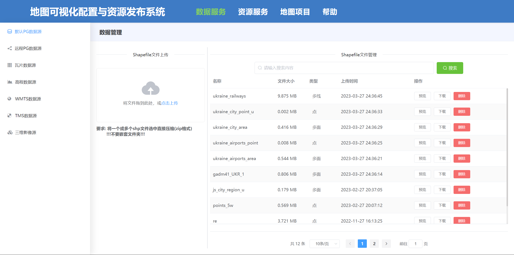
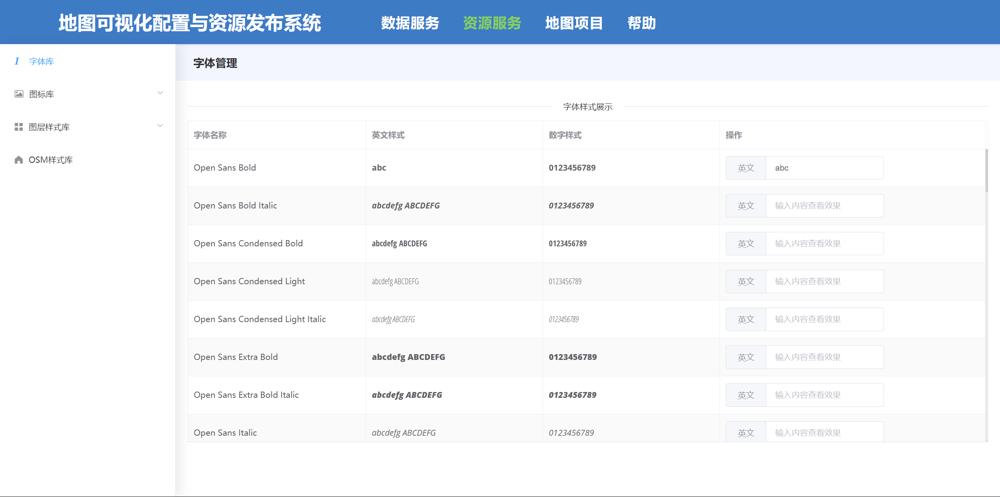
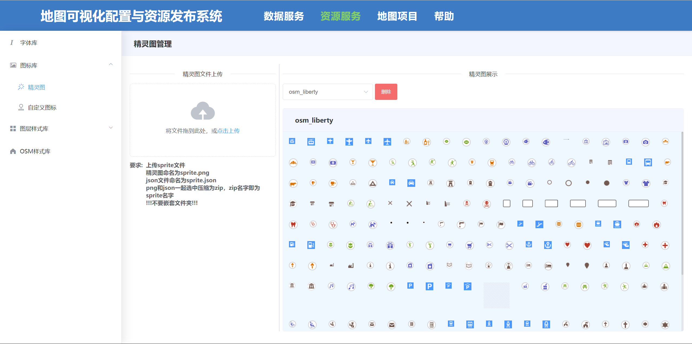
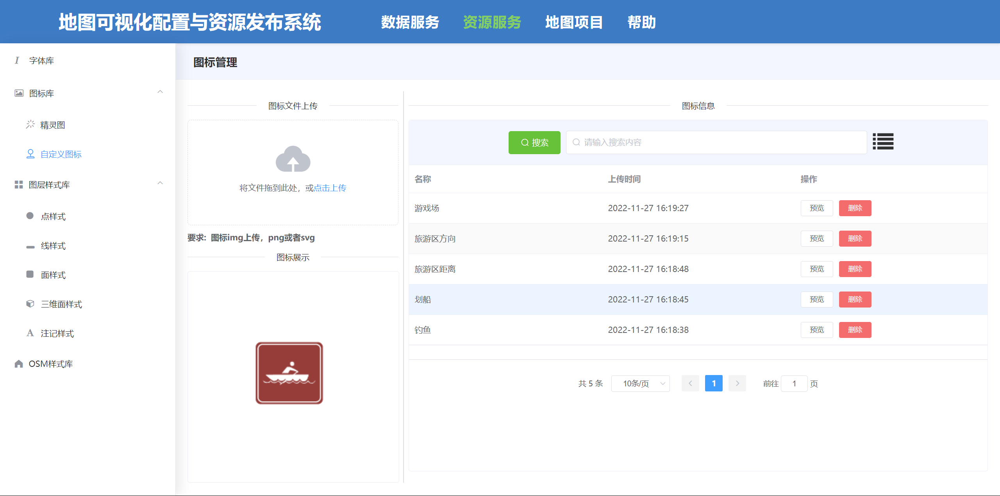
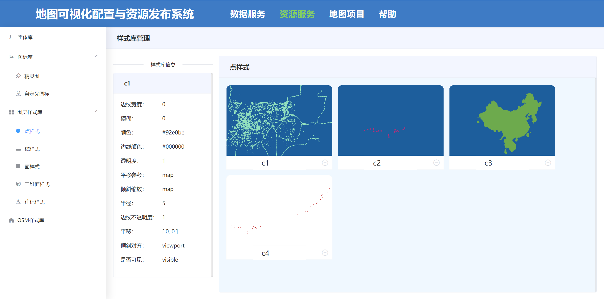
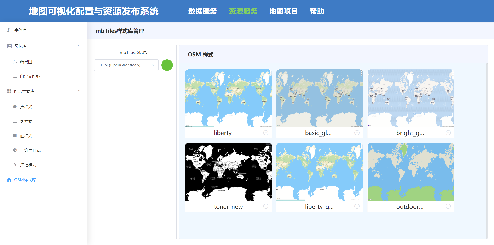
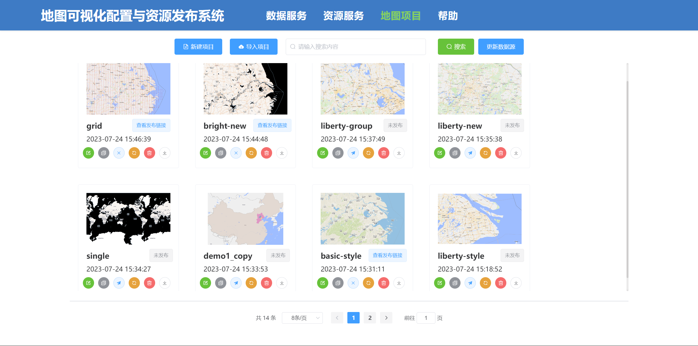
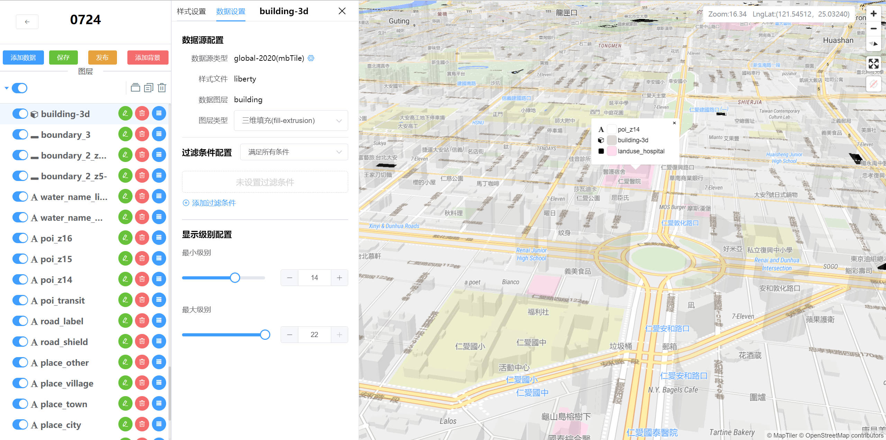
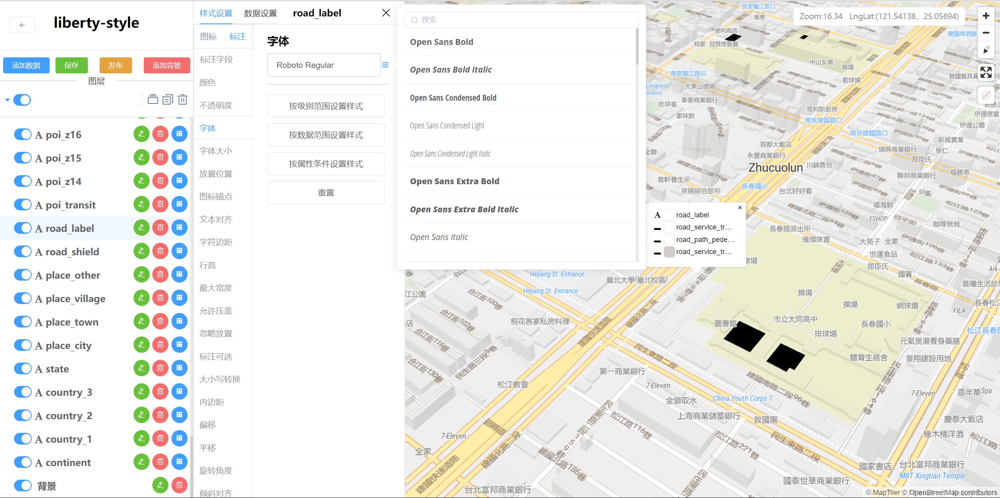
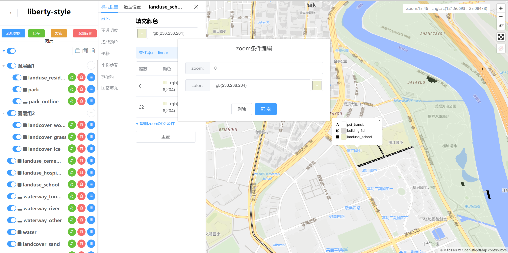

## **地图可视化配置与资源发布系统**

### 1 系统介绍

****

​        地图矢量瓦片的出现使得前段动态配图成为可能。本系统系统基于[Mapbox GL JS ](https://docs.mapbox.com/mapbox-gl-js/guides/)开发，实现在线配置地图，结合用户友好的编辑面板，使得配置一幅电子地图极为方便。基于PostGIS和PostgreSQL实现地图矢量瓦片的生产与数据发布，配合地图样式管理，实现了一整套完整的地图配图方案。

### 2 系统亮点

****

1. ##### 全面设计控制

   支持全部地图图层的无差别编辑，支持配置自定义字体、自定义图标。导入用户自己的数据，在提供的多模版底图基础之上，制作自己的专题地图。

2. ##### 地图数据可视化

   提供快速的地图数据预览，支持多种常见的矢量地图数据格式。相比于传统GIS软件，更加方便快捷。

3. ##### 多数据源集成

   地图数据来源可以是最常用的Shapfile、GeoJSON，也可以是完整的MBTils矢量瓦片数据库。平台还支持TMS、WMTS等第三方数据源的接入。

4. ##### 跨平台发布

   结合Mapbox地图渲染引擎，可以在任何平台将自己创作的专题地图作为其底图使用。

### 3 核心功能

****

1. ##### 可视化配置地图。

   用户可以在浏览器中使用界面友好的编辑面板配置所有图层样式，如颜色、宽度、不透明度、平移、抗锯齿、拐角形状等等。支持对同一数据的多图层样式修改，如面数据以点样式、线样式、立体样式展示等等。支持按层级配置图层的显隐，支持图层样式库的应用、支持地图整体样式的应用等多种地图配图操作。

2. ##### 多地图数据源接入

   用户可以上传自己的Shapefile数据和MBTiles数据，系统后台对不同类型分别进行数据处理与发布。此外，系统支持第三方数据源接入，作为地图配置的数据源。

3. ##### 地图资源配置与管理

   系统支持高度的自定义地图资源接入与管理，包括字体、图标、点线面体的样式库、地图整体风格库等等资源。同时，用户可以自己编辑样式存储在样式库中。

4. ##### 地图主题管理

   地图配图项目以方案结构进行组织，可保存、编辑、复制、发布、更换源、导出、导入。导入与导出实现了不同物理设备之间的迁移，极大减轻了用户的重复工作。

### 4 系统截图

****

1. 数据源接入页

   

2. 地图资源管理页

   

   

   

   

   

3. 地图项目管理页

   

4. 可视化配置地图。

   

   

   


### 5 使用

****

##### 项目建立

```
npm install
```

##### 启动

```
npm run serve
```

##### 打包

```
npm run build
```


